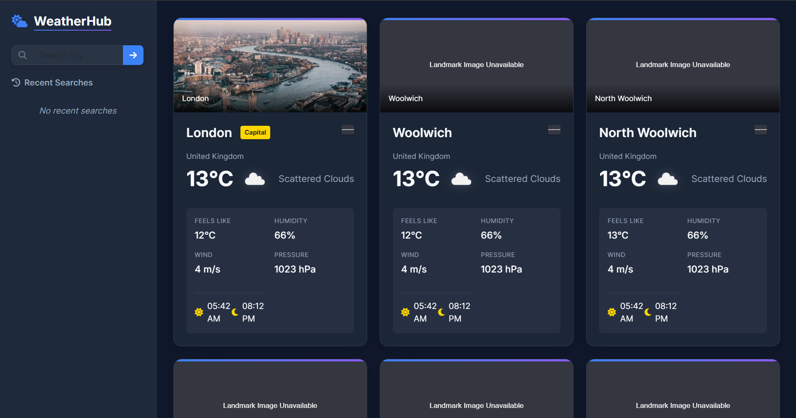

# WeatherHub

 

**Global Weather Dashboard** for real‑time conditions and 5‑day forecasts across the world.

---

## [📺 Demo](https://priyanshuth.github.io/WeatherHub/)



---

## ✨ Features

- 🌍 **Geolocation Start**: Detects your location (with permission) and auto‑loads local weather and nearby cities.
- 🔍 **Global Search**: Fuzzy search any city worldwide.
- 💾 **Recent Searches**: Quick access to your last five queries, stored in `localStorage`.
- 📊 **Detailed City Cards**: Temperature, feels‑like, humidity, wind speed, pressure, sunrise/sunset times, country flag, and landmark image.
- 🏅 **Capital Badge**: Highlights capital cities with a gold badge.
- 📈 **Forecast Modal**: Interactive 5‑day charts (temperature, precipitation, wind) via Chart.js.
- ⚡ **In‑Memory Caching**: API responses cached for 5 minutes to reduce calls and speed up reloads.
- 📱 **Responsive Design**: CSS Grid + Bootstrap ensure seamless mobile, tablet, and desktop layouts.
- 🚫 **Zero‑Build**: No bundler required—just serve `index.html`.

---

## 🧰 Tech Stack

- **JavaScript** (ES 6 modules)
- **Bootstrap 5**
- **Chart.js**
- **OpenWeather API**
- **HTML5**, **CSS3** (Glass‑morphism styling)

---

## 🚀 Quick Start

1. **Clone the repo**:
   ```bash
   git clone https://github.com/priyanshuTh/WeatherHub.git
   cd weatherhub
   ```
2. **Configure API Key**:
   - Open `src/js/api.js`
   - Replace the placeholder `API_KEY` with your OpenWeather API key.
3. **Serve the app**:

   ```bash
   # Option A: Live Server
   npx live-server

   # Option B: Python HTTP Server
   python3 -m http.server 8080
   ```

4. **Open in browser**: Visit <http://localhost:8080>

---

## 📁 Project Structure

```text
weatherhub/
├── docs/                # Screenshots and assets for GitHub Pages
├── src/
│   ├── css/
│   │   └── style.css    # Custom glass‑morphism theme
│   └── js/
│       ├── api.js       # OpenWeather API wrapper + caching
│       ├── dashboard.js # Dashboard controller class
│       ├── ui.js        # DOM manipulation & Chart.js renderers
│       ├── utils.js     # Helper functions (formatting, flags, landmarks)
│       └── main.js      # Entry point
├── index.html           # Single page shell
└── LICENSE              # MIT license
```

---

## ⚙️ Development Scripts (Optional)

| Script           | Description                               |
| ---------------- | ----------------------------------------- |
| `npm run lint`   | Lint code with ESLint (Airbnb Base rules) |
| `npm run format` | Format code with Prettier                 |
| `npm run dev`    | Launch Live Server with file watching     |

> Requires Node.js v18+ for the helper scripts, but the app itself runs in any static server.

---

## 🤝 Contributing

1. Fork the repository.
2. Create a feature branch: `git checkout -b feat/my-feature`
3. Commit your changes: `git commit -m "feat: add my feature"`
4. Push to your branch: `git push origin feat/my-feature`
5. Open a Pull Request.

Thank you for your contributions! 🎉

---

## 📝 License

This project is licensed under the **MIT License**. See [LICENSE](LICENSE) for details.

---

## ✉️ Contact

Created by [priyanshuTh](https://github.com/priyanshuTh). Questions or suggestions? Open an issue or tweet @yourhandle.
